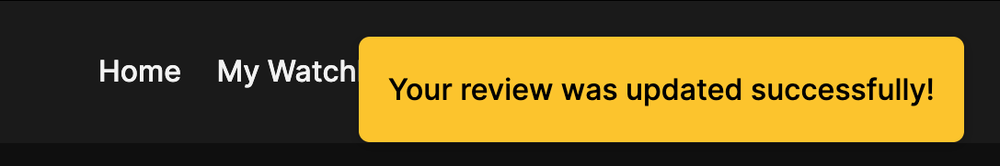
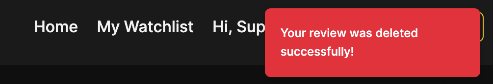
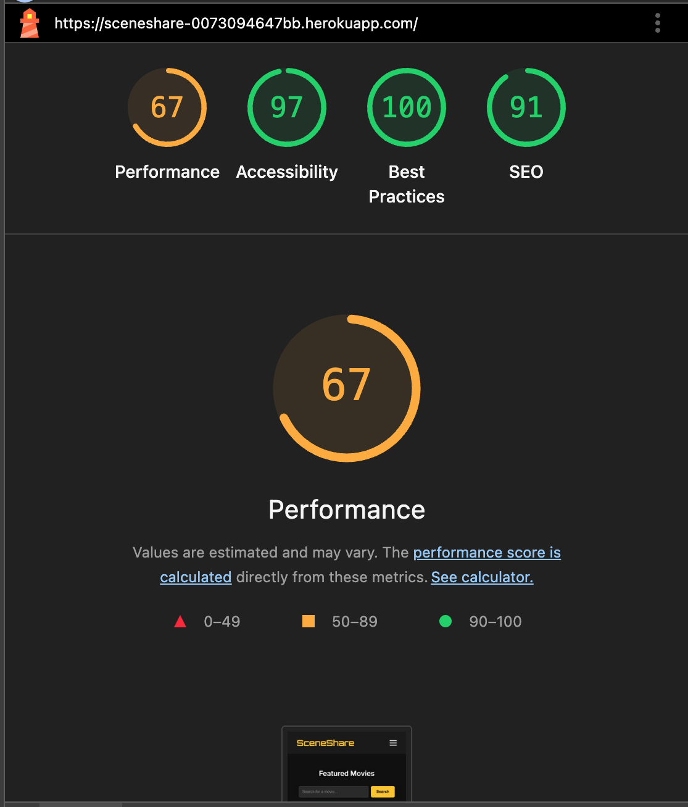
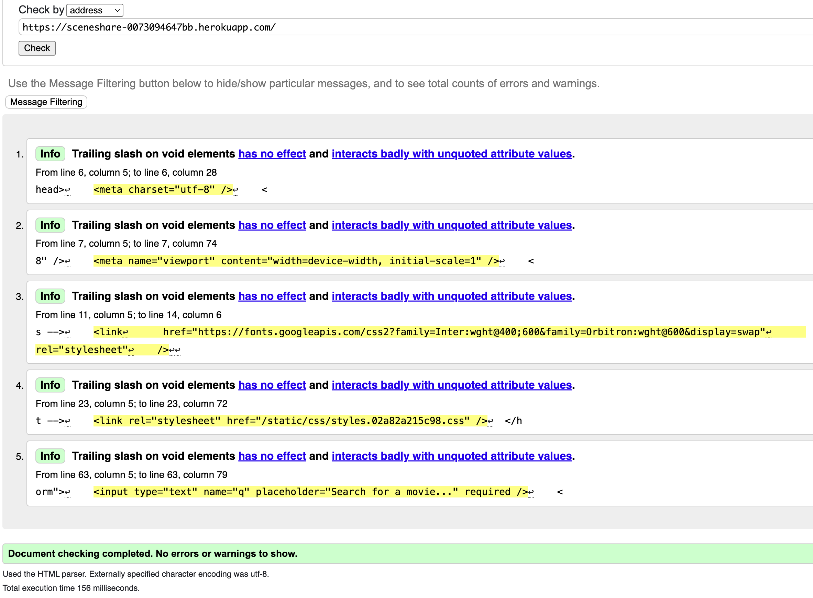
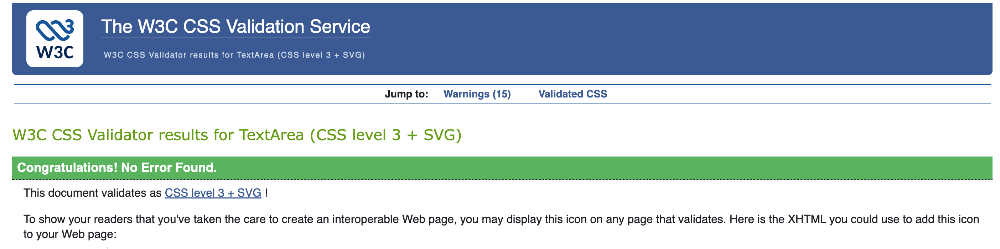
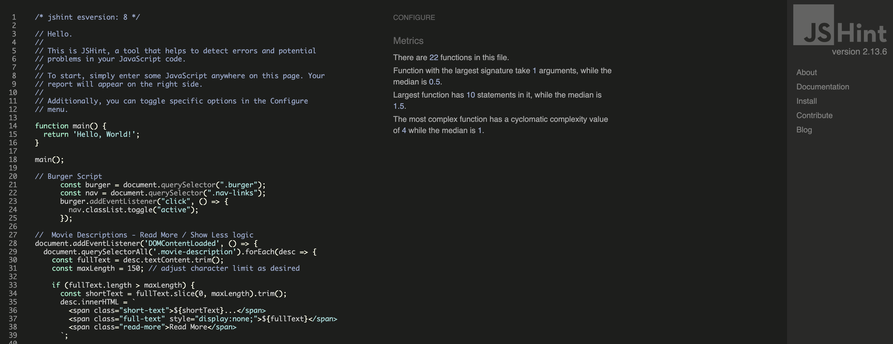
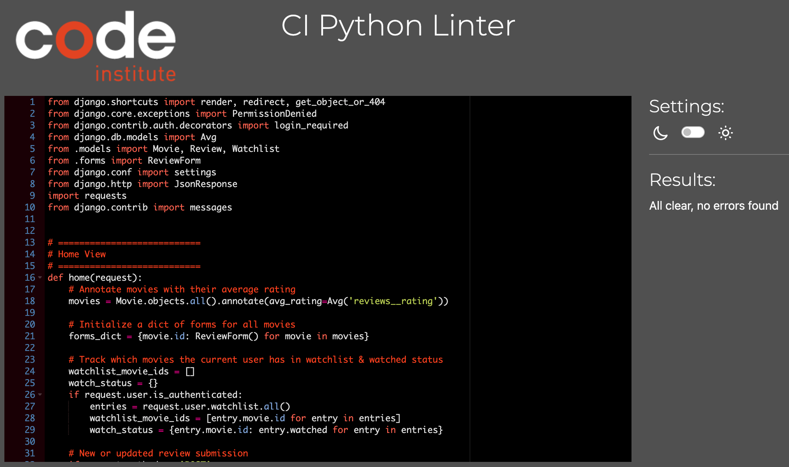
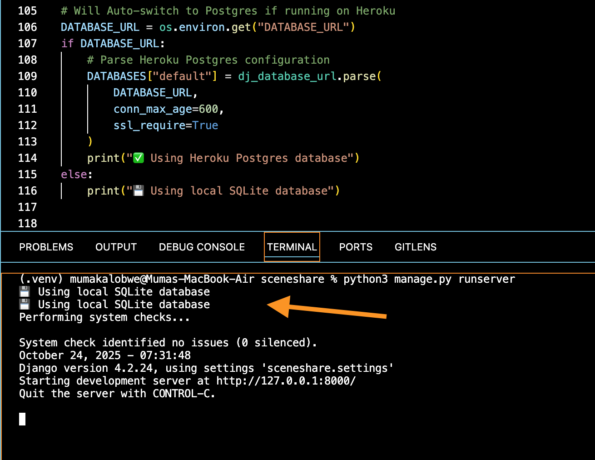

<div align="center">
  
  <br>

  <p><strong> SceneShare is a Django-based Movie Review & Watchlist platform that integrates with the TMDB API to let users discover, review, and organize their favorite films.</strong></p>

  <!-- Tech Stack Badges -->
  <a href="https://www.djangoproject.com/">
    
  </a>
  <a href="https://www.python.org/">
    
  </a>
  <a href="https://www.postgresql.org/">
    
  </a>
  <a href="https://developer.mozilla.org/en-US/docs/Web/HTML">
    
  </a>
  <a href="https://developer.mozilla.org/en-US/docs/Web/CSS">
    
  </a>
  <a href="https://developer.mozilla.org/en-US/docs/Web/JavaScript">
    
  </a>
  <a href="https://www.heroku.com/">
    
  </a>
</div>

---

## **Table of Contents**
1. [Project Overview](#project-overview)
    - [Technologies Used](#technologies-used)
    - [Real-World Rationale](#real-world-rationale)
2. [User Experience (UX)](#user-experience-ux)
   - [Project Goals](#project-goals)
   - [User Stories](#user-stories)
   - [Design Choices](#design-choices)
3. [Agile Methodology](#agile-methodology)
4. [Database Design](#database-design)
5. [Features](#features)
    - [Future Features](#future-features)
6. [Testing](#testing)
    - [Automated Test Coverage Overview](#automated-test-coverage-overview)
    - [Manual Testing](#manual-testing)
    - [Validation](#validation)
7. [Deployment](#deployment)
8. [Credits](#credits)

<br><br>

# **Project Overview**

---


**SceneShare** is a full-stack Django web application that offers full CRUD functionality, enabling users to:
- Browse and review movies.  
- Rate films and share their opinions.  
- Create and manage a personalized watchlist.  

The platform blends **community interaction** with **individualized movie management**, designed to provide a seamless experience for film enthusiasts. It follows Django’s **Model–View–Template (MVT)** architectural pattern and emphasizes clean, modular code practices consistent with Code Institute’s professional development standards — all within an intuitive, responsive interface.


<br>

<div align="center">
  
  <p><em>Desktop, Tablet & Mobile Device Mockup</em></p>
</div>

<br><br>

## **Technologies Used**

<br>

| Category | Technology |
|-----------|-------------|
| **Frontend** | HTML5, CSS3, JavaScript (modularized) |
| **Backend** | Python 3, Django Framework |
| **Database** | SQLite (development), PostgreSQL (Heroku deployment) |
| **Version Control** | Git & GitHub |
| **Deployment** | Heroku |
| **Tools** | GitHub Projects (Agile board), ERD diagramming tools, Code Validator, Django Admin, Bootstrap (initially) |

<br><br>

## **Real-World Rationale**

In today’s digital entertainment landscape, movie enthusiasts seek platforms that go beyond passive viewing — they want community, curation, and conversation. However, many existing services either lock these features behind subscriptions or lack meaningful interactivity.

SceneShare addresses this gap by offering a streamlined space where users can:

- 🍿 Browse and review films through a structured, user-friendly interface.
- ⭐ Rate and reflect on movies they’ve watched, fostering shared discovery.
- 🎬 Build and manage personalized watchlists, tracking what to watch next.

Designed with Django’s Model–View–Template (MVT) architecture, SceneShare demonstrates how a full-stack application can combine community engagement with individualized film management. <br><br> The platform’s emphasis on responsiveness, modularity, and user-centered design reflects real-world expectations of modern review and recommendation systems.

Ultimately, SceneShare provides a foundation for a vibrant review community — illustrating how thoughtful web development can bring people together around media stories that inspire, challenge, and entertain.

🔗 [Live Site: SceneShare on Heroku](https://sceneshare-0073094647bb.herokuapp.com/)

<br><br>

# **User Experience (UX)**

---

### **Project Goals**
- Provide a user-friendly movie review and watchlist platform.
- Allow users to add, view, and edit their movie reviews.
- Enable rating-based insights to guide other users’ film selections.
- Provide a simple, responsive interface with visual confirmation for key user actions.

### User Interface
The initial design emphasized a clean, simple and intuitive layout built with the Bootstrap grid system, allowing users to easily browse popular movies on the homepage and search for their favorite titles. A hand-drawn wireframe of the original concept is shown below:

<br>

<div align="center">
  
  <p><em>SceneShare hand-drawn wireframe sketch</em></p>
</div>

<br>

The first implemented version of the platform is shown below, reflecting the transition from the initial wireframe concept to a functional interface:

<br>

<div align="center">
  
  <p><em>SceneShare version 1 - Bootstrap styling</em></p>
</div>

<br>

### **Design Choices**
---

While the initial version of SceneShare was functional, it lacked the level of polish and modern aesthetic I envisioned. Furthermore, because the original review system relied on basic radio inputs, dynamically rendering star ratings for reviewers with JavaScript while maintaining consistent element display proved challenging when **only** using Bootstrap.
<br><br>
To achieve greater control and versatility, I transitioned to custom styling. Below are some of the key design changes implemented:

- **Custom Styling:** Replaced Bootstrap’s default styling and grid system with vanilla HTML and custom CSS. Since multiple templates had to be developed, I initially wrote inline CSS for each page to isolate and test individual components before consolidating them into a single main stylesheet during the later stages of development.
- **Custom Form Styling:** Replaced Django’s default crispy forms and Bootstrap with a custom-styled UI for greater control and visual consistency.  
- **Authentication:** Implemented a **custom user registration and login system** instead of the prebuilt Django AllAuth for more flexibility and cleaner integration. (AllAuth integration is planned for future iterations to enable Google/Facebook login.)  
- **Feedback System:** Introduced **visual confirmation messages** later in development to address usability gaps—users now receive immediate confirmation after posting or editing reviews.  
- **JavaScript Refactoring:** All Javascript code was moved to a standalone file for clarity and validation compliance.  

<br><br>
The final iteration adopted a hybrid approach, merging features from the initial layout with the dark mode aesthetic developed in a separate movie watchlist project. A screenshot of the Figma design file is shown below, and [the live link is provided here for reference](https://www.figma.com/design/2PZDPDM0KO42hHp0lHsygM/Movie-Watchlist---Muma?node-id=0-1&p=f).

<br>

<div align="center">
  
  <p><em>Figma design screenshot</em></p>
</div>

<br>


<br><br>

# **Agile Methodology**

Development followed **Agile principles** using GitHub Issues and a Kanban board.  
- Each issue represented an epic, with sub-issues containing actionable tasks and user stories.
- Larger features were divided into **sub-issues** for incremental progress tracking.  

This approach ensured an iterative, test-driven workflow aligned with the project scope, deadlines, and overall structure.

<br>

---

## **User Stories**

All user stories were tracked and managed using Agile methodology on GitHub Projects (Kanban board format). This approach provided a transparent and iterative development process, allowing for efficient prioritization, progress tracking, and sprint-style delivery.
<br>

### 1. Project Overview Board

The Kanban board was organized into three main columns — **To Do**, **In Progress**, and **Complete** — representing each stage of the development lifecycle.
This structure ensured that all user stories moved through a clear workflow from conception to deployment.

<br>

<div align="center">
  
</div>

<br>

### 2. Epic with Linked User Stories

Each **epic** represented a major feature of the project (e.g., Watchlist Management or Authentication & Profiles). Within each epic, smaller sub-issues were created as user stories to break down the functionality into actionable development tasks.

<br>

<div align="center">
  
  <p><em>Example Epic with Linked User Stories</em></p>
</div>

<br>

### 3. Epic with Linked User Stories

A step further, every user story included clear and defined acceptance criteria with a markable checkbox to ensure that the intended functionality was testable and measurable.
This facilitated a user-centric approach and provided clear completion indicators for each deliverable.

<br>

<div align="center">
  
  <p><em>Example User Story with Acceptance Criteria.</em></p>
</div>

<br>


The complete project board, including all epics, issues, sub-issues, and user stories, [can be accessed here](https://github.com/users/BlvckKryptonite/projects/4/views/1).

Below is a refined version of initial user stories, scribbled down prior to development to cover different user perspectives:

<br>

| As a ... | I want to ... | So that I can ... |
|-----------|----------------|-------------------|
| Site Visitor | View a list of movies | Discover films worth watching |
| Registered User | Add movies to my watchlist | Keep track of what I plan to watch |
| Reviewer | Post a review for a movie | Share my thoughts and ratings |
| Reviewer | Edit or delete my reviews | Correct mistakes or change opinions |
| User | Receive confirmation when I submit a review | Know that my action succeeded |
| Admin | Manage movie entries and user submissions | Maintain platform integrity |
| Developer | Keep JS, CSS, and templates organized | Ensure code maintainability |
| Reviewer | Access my watchlist and reviews easily | Manage my movie engagement |
| Admin | Validate and document code thoroughly | Ensure project quality and scalability |


<br><br>

# **Database Design**

---

SceneShare was structured around Django’s ORM with custom models across three apps:
- **Movie app** 
    - Movie model - represents a movie with details such as title, description, release year and poster.
    - Review model - linked to both User and Movie, containing rating and review text.
    - Watchlist - enables users to add or remove movies from their personalized list.  
- **Accounts app** – extended from Django’s default model with custom authentication logic.  
    - Profile - extends the built-in User model with additional profile information.
- **Community App** - interacts with both the movie and accounts apps. Responsible for community features and interaction between users.
    - ReviewLike - represents a 'like' given by a user to a movie review.
    - Comment - represents a comment given by a user to another user's review
    - ProfileView - allows users to click other user's profiles.
<br><br>

### Alignment with Domain Purpose

Each model within SceneShare was intentionally designed to mirror real-world movie review dynamics, ensuring that the database structure directly supports the platform’s objectives.

By clearly defining the relationships between users, movies, reviews, and watchlists, the application’s data model delivers both functional clarity and logical consistency.

<br>

### Entity Relationship Diagram

A hand-drawn **Entity Relationship Diagram (ERD)** was used in early design stages to map out the relationships. The diagram highlights how each entity connects to deliver SceneShare’s review and watchlist features in a cohesive structure. Below is the aforementioned ERD enhanced with AI for clarity:

<br>

<div align="center">
  
  <p><em>Entity Relationship Diagram (ERD)</em></p>
</div>

<br>


**Model Methods Implemented:**
- `get_average_rating()` — Calculates the average rating for each movie.  
- `__str__()` — Returns human-readable representations for admin and debugging.  
- Slug generation for URL identifiers.  


<br><br>

# **Features**

---


### **Implemented Features**
I. **User Authentication** 
- Custom user authentication system (sign-up, login, and logout) featuring a dynamic, space-themed background GIF created by a very talented digital artist — credit and source [available here](https://media.giphy.com/media/v1.Y2lkPWVjZjA1ZTQ3cnoxNXpxb2xuMnYyMXB5aDNyM2hrdm1jcDFvNGY1NHVqMzgzdjhwOCZlcD12MV9naWZzX3JlbGF0ZWQmY3Q9Zw/3o7aDcrsww5Ybp18hq/giphy.gif).
- Form validation and error messaging.  

II. **Movie Listing & Detail Views** 
- Dynamic pages display movie details and user reviews.  
- Slug-based URLs ensure clean and descriptive routing.  

III. **Review System** 
- Authenticated users can submit, edit, and delete reviews.  
- Ratings integrated into movie detail pages.  
- Confirmation messages provide feedback on successful submission.  

IV. **Watchlist Management** 
- Users can add movies to a personal watchlist.  
- Accessible from the profile menu.  

V. **Responsive Frontend** 
- All CSS refactored and validated through W3C tools.  
- Clean, minimal interface built with custom CSS (Bootstrap replaced).  

VI. **Code Quality** 
- Docstrings and inline comments added for maintainability.  
- JavaScript and Python logic separated for clarity and validation compliance.  

<br><br>

---

## **Future Features**

The following features were planned but deliberately postponed to maintain a clear MVP scope. While interactive, some functionalities - such as comment threads — could detract from the app’s main purpose: allowing users to **review movies and manage watchlists efficiently**.
<br><br>
Keeping the platform lean ensures that users can quickly see what others think about a movie without unnecessary clutter. Users can still engage with reviews through a “like” system to highlight helpful or insightful opinions.

Potential future enhancements include:

- **Comment Threads** 🗨️ — Enable users to comment on individual reviews.  
- **User Profiles** 👤  — Allow viewing of other users’ profiles and their movie activity.  
- **Social Authentication** 🔐  — Integration of Django AllAuth for Google/Facebook sign-ins.  
- **Community Feed** 📰 — Provide real-time updates of trending movies and popular reviews.  

<br>

**Rationale for exclusion:**

Adding these features would have increased database and view complexity, potentially detracting from the project’s core functionality. The app remains focused, streamlined, and aligned with the agile and MVP goals.

<br><br>

# **Testing**

---

A combination of extensive automated and manual tests was implemented across key components of the application to ensure reliability, maintainability, and consistent functionality after code changes.

- All views, models, and forms were tested using Django’s built-in **`TestCase` framework** and executed with: 

<br>  

    python3 manage.py test

<br>

### A total of **30 site-wide tests were executed successfully without errors below ✅**

<br>

<div align="center">
  
  <p><em>Automated unit test results across all apps</em></p>
</div>

<br>

## Comprehensive Testing Breakdown

Extensive unit tests were implemented across all key Django app modules to verify functionality, reliability, and integration between components.

Each test suite was executed using Django’s built-in test runner, for example:

        python3 manage.py test movies --verbosity=2
        python3 manage.py test accounts --verbosity=2
        python3 manage.py test reviews --verbosity=2

<br>

All tests were run locally using the development SQLite database, and after interation - all test cases passed successfully.

During testing, Django automatically creates a temporary test database, applies migrations, and tears it down after completion — ensuring that no production or development data is affected.

<br>

## Automated Test Coverage Overview

### 1. Movies App

A dedicated test suite was implemented to verify the stability and reliability of the Movies app. Given the app’s complexity and central role in the project, it contains the majority of the overall test coverage. To maintain structure and clarity, a separate `tests` directory was created, containing four focused test modules — `test_forms.py`, `test_models.py`, `test_urls.py`, and `test_views.py`.

Each test class includes detailed docstrings for clarity and maintainability.  

**Tests covered:**

- **Models:** Validates successful creation and string representation of movie instances.
- **Views:** Confirms accessibility of key movie-related views and correct template rendering.
- **Forms:** Tests form validation logic, including required fields and handling of invalid inputs.
- **Urls:** Confirms correct URL resolution, template context, and expected HTTP status codes.

<br>

📄 **To run tests in a specific test file**

For example running only the tests from test_views.py inside the movies app:

    python3 manage.py test movies.tests.test_views --verbosity=2

<br>

<div align="center">
  
</div>

<br>

🧩 **To run all comprehensive tests in the app:** 

    python3 manage.py test movies --verbosity=2


**Result:**

 - All model tests passed with no errors ✅

<br>

### 2. Accounts app

Comprehensive tests were written for the **Accounts** app to ensure smooth user registration, profile management, and authentication flows.

This app’s tests are contained in a single file, focusing on validating model integrity, form handling, and authenticated view behavior.

**Tests covered:**

- **Models:** Verifies that a `Profile` instance is automatically created for each new `User`, and confirms the correct string representation of profiles.
- **Views:** 
    - **Register View:** Ensures the registration page renders properly on GET requests and successfully creates a user on valid form submission.
    - **Profile View:** Confirms that authenticated users can access and update their profiles, including username and bio changes, and receive success messages upon update.
- **Integration:** Validates signal functionality to automatically link and save user profiles after user creation or updates.

<br>

 **Command Used:**

    python3 manage.py test accounts --verbosity=2

**Result:** All six tests passed successfully ✅

<br>

<div align="center">
  
  <p><em>Accounts app test reults</em></p>
</div>

<br>

### 3. Community app

The **Community app**’s test suite focuses on validating the like/unlike system for movie reviews through the `ReviewLike model` and related view logic.

These tests ensure that user interactions such as liking, unliking, and authentication checks function correctly through both backend logic and JSON responses.

**Tests covered:**

- **Models:** Validates the string representation of the `ReviewLike` model for accurate and readable output.
- **Views:** 
    - Confirms that only authenticated users can like or unlike reviews.
    - Ensures proper JSON responses are returned on successful like/unlike actions, including updated like counts and status flags.
    - Tests that invalid request methods (like GET) return appropriate error messages and status codes.
- **Integration:** Ensures consistency between related models (`Review`, `Movie`, and `User`) during like/unlike toggling operations.

<br>

 **Command Used:**

    python3 manage.py test community --verbosity=2

**Result:** All four tests passed successfully ✅

<br>

<div align="center">
  
  <p><em>Community app test reults</em></p>
</div>

<br><br>


## **Manual Testing**

In addition to the automated Django test suite, extensive **manual testing** was performed to verify that all key features function as intended.

Testing covered authentication, CRUD operations, navigation flow, and overall user interface responsiveness across different devices.

During user-based testing sessions, it was discovered through test users that certain interactions, such as submitting or editing reviews, lacked clear confirmation of success.

To improve user experience, **visual feedback messages** were implemented throughout the site. These appear upon successful actions (e.g., review submission, profile update) and automatically disappear after a short delay using basic `setTimeout` JavaScript for smoother UX.

<br>

**Each core feature was manually tested to confirm successful operation. Below are a few user operations and their respective visual feedback messages:**

<br>

| Test | Description | Action Screenshot |
|------|--------------|------------------------|
| **Add Review** | Successful review submission with success message |  |
| **Edit Review** | Edited review displayed correctly |  |
| **Delete Review** | Review removed successfully |  |
| **Watchlist Management** | Add/remove movies from watchlist |  |


<br><br>

### Manual Testing Breakdown

Below is a detailed breakdown of manual user actions conducted by test users to ensure that all core features of the application function as intended.

Each key feature was tested across various devices and browsers to confirm consistent performance, proper validation, and expected user feedback.

<br>

| Feature | Test Scenario | Expected Outcome | Result | Pass/Fail |
|----------|----------------|------------------|---------|------------|
| **Registration** | Submit valid form data | Account is created and user redirected to home page | Works as expected | ✅ Pass |
| **Login/Logout** | Enter correct credentials / click logout | Login grants access to dashboard; logout redirects to home | Works as expected | ✅ Pass |
| **Add Review** | Submit a review on a movie detail page | Review is saved and visible immediately with confirmation message | Works as expected | ✅ Pass |
| **Edit Review** | Edit an existing review and resubmit | Updated review replaces old version | Works as expected | ✅ Pass |
| **Delete Review** | Click delete on own review | Review is removed from page and database | Works as expected | ✅ Pass |
| **Watchlist Add/Remove** | Add or remove movies | Watchlist updates dynamically | Works as expected | ✅ Pass |
| **Visual Confirmation** | Submit form on various pages | Success message appears on each relevant page | Works as expected | ✅ Pass |
| **Navigation** | Click all nav links on desktop/mobile | All pages load correctly, responsive layout retained | Works as expected | ✅ Pass |
| **Form Validation** | Submit invalid or empty fields | Errors displayed, submission blocked | Works as expected | ✅ Pass |
| **Responsive Design** | Test on Chrome, Safari, Firefox, mobile viewports | Layout adjusts and remains readable | Works as expected | ✅ Pass |

<br><br>


**Accessibility Check:** 

Responsiveness was tested using Chrome DevTools and multiple devices (iPhone, iPad, MacBook Air).  
Accessibility audits were run using the **Lighthouse** tool and **Chrome Accessibility Insights**.

- All buttons and form elements have accessible labels.  
- Keyboard navigation tested successfully.  
- Contrast ratio validated through Chrome DevTools accessibility checker.
- Additional Browser Testing: Chrome (Mac, Windows), Safari (Mac), Firefox (Mac) and Safari Mobile (iPhone 14)

<br>

### Performance Optimization Summary

SceneShare underwent Lighthouse performance testing to evaluate load speed, accessibility, and best practices. The application achieved outstanding scores in all key areas, with **Accessibility (97)**, **Best Practices (100)**, and **SEO (91)**.

The **Performance score (67)** primarily reflects network and static file delivery factors related to the Heroku hosting environment rather than inefficient code.


#### Optimizations Implemented:

1. Deferred JavaScript loading to reduce render-blocking scripts.

2. CSS preloading to prioritize essential styles and improve First Contentful Paint (FCP).

3. Lazy loading for images to minimize initial payloads and enhance visual load performance.

3. Optimized Django template structure for minimal DOM depth and efficient rendering.

4. Responsive image sizing and compressed assets to ensure smooth loading on all devices.


<br>

<div align="center">
  
  <p><em>Lighthouse Audit Results.</em></p>
</div>

<br>

#### Performance Analysis

  While the perfomance metric is not ideal, testing revealed that Heroku’s static file delivery slightly limits raw performance scores due to the lack of CDN-level caching and edge optimization. However, all client-side optimizations are in place, and the site remains fast and responsive across real-world usage.


### Future Optimization:

- Migrate to a CDN-backed platform (e.g., Vercel or Cloudflare Pages) for static asset caching and reduced latency.

- Implement HTTP caching headers to leverage browser-side asset reuse.

- Further minify CSS/JS bundles through build-time optimization.

Overall, SceneShare demonstrates high optimization maturity, balancing Django’s dynamic functionality with frontend performance best practices.


<br><br>

## Validation

All HTML, CSS, Javascript and Python code validated through W3C, JSHint and PEP8 standards. Files were validated using official standards and the recommended tools to ensure clean, maintainable, and error-free code. Each language was tested through its respective validator, and any issues identified were resolved prior to deployment.

The following sections outline the specific validation tools and processes used for each language, along with any adjustments or findings from the validation results.

<br>

### **1. HTML Validation**

All HTML templates were tested using the [W3C Markup Validation Service](https://validator.w3.org/).  
Only informational messages (e.g., notes about optional trailing slashes on void elements) and minor warnings related to Django templating syntax (`` and `{{ }}`) were returned. 

They were ignored, as they do not affect browser rendering, code functionality or compliance.

<br>

<div align="center">
  
  <p><em>HTML Validation Screenshot</em></p>
</div>

<br>


---

### **2. CSS Validation**

All CSS passed through the [W3C CSS Validator](https://jigsaw.w3.org/css-validator/).  

The W3C CSS Validator confirmed that all stylesheets passed with no errors found.
An informational note appeared stating that CSS variables are “not statically checked due to their dynamic nature”, which is expected behavior for custom CSS properties and does not affect validation.


<br>

<div align="center">
  
  <p><em>CSS Validation Screenshot</em></p>
</div>

<br>


---

### **3. Javascript Code Validation**

All JavaScript files were validated using [JSHint](https://jshint.com/) to ensure code quality and adherence to best practices. The validation process helped identify potential syntax errors, undeclared variables, and compatibility issues.

No major issues were found during validation. Minor warnings, such as ES6 syntax compatibility (`'const' is available in ES6 (use 'esversion: 6')`), were resolved by updating the JSHint configuration to support modern JavaScript features.

<br>

<div align="center">
  
  <p><em>JSHint Validation Screenshot</em></p>
</div>

<br>

---


### **4. Python Code Validation**

This project has *several* Python files across all custom apps. All of them were validated through [PEP8 Online Checker](https://pep8ci.herokuapp.com/) to ensure compliance with PEP8 standards.

The validation process involved reviewing each file for proper indentation, spacing, line length, and naming conventions to maintain code readability and consistency.

No significant errors were found during validation. Minor whitespace and formatting issues identified in development were corrected to meet the standard Python style guide requirements.

<br>

<div align="center">
  
  <p><em>PEP8 Validation Screenshot</em></p>
</div>

<br>

---


### **Testing Evidence Summary**

All core features and pages passed both automated and manual testing phases. All critical paths (user authentication, CRUD operations, navigation, and feedback messages) function as intended. Minor layout refinements were applied during testing to improve spacing consistency on smaller devices.  

Validation results confirm that SceneShare adheres to:

- Django framework best practices  
- PEP8 Python styling standards  
- HTML/CSS validation compliance 
- JSHint code quality and adherence to best practices
- Accessibility and responsiveness standards  

The application is verified as **stable, performant, and developed to a high standard** in line with Code Institute’s assessment criteria.


<br><br>


# Deployment

---

### Heroku Deployment Steps

1. **Create a new Heroku app** and connect your GitHub repository.

2. In your terminal, install the required packages:
   ```bash
   pip3 install gunicorn dj_database_url psycopg2

3. Create a Procfile in the project root directory with the following line:
   ```bash
   web: gunicorn sceneshare.wsgi

4. Set environment variables on Heroku:
    - SECRET_KEY

    - DATABASE_URL

    - DEBUG=False

5. Migrate the database:
   ```bash
   heroku run python manage.py migrate

6. Deploy and verify the live version. 

[🔗 You can access my live app here →](https://sceneshare-0073094647bb.herokuapp.com/)

<br>


---

## **Deployment Verification Checklist**

This section outlines the full deployment process, configuration steps, and environment setup used to deploy **SceneShare** to Heroku.

#### **1. Project Setup**
- Created a repository on [GitHub](https://github.com/).

- Created and activated a virtual environment:
   ```bash
   python3 -m venv .venv
   source .venv/bin/activate


- Installed all dependencies:

   ```bash
   pip3 install -r requirements.txt
   
- Add installed dependencies to `requirements.txt` file with this command:

   ```bash
   pip3 freeze > requirements.txt

- This ensures that the latest working versions of all dependencies are recorded.

  - Example dependencies included in this project:

    ```bash
    Django==5.0.2
    dj-database-url==2.1.0
    gunicorn==21.2.0
    psycopg2==2.9.9
    whitenoise==6.6.0
    cloudinary==1.36.0

#### 2. Django Configuration

- Created .env file (excluded from version control via .gitignore).

    - Added the following environment variables:

          SECRET_KEY=<your_secret_key>
          DEBUG=False
          DATABASE_URL=<your_postgresql_database_url>
          ALLOWED_HOSTS=['sceneshare-0073094647bb.herokuapp.com', 'localhost', 127.0.0.1]


- Updated settings.py to:

    * Use os.environ.get() for sensitive keys.

    * Configure static and media files for Heroku.

    * Set DEBUG=False in production.

#### 3. Database Setup

- Initially used SQLite3 for local development.

- For production, the project was migrated to PostgreSQL on Heroku, since Heroku’s filesystem is ephemeral — meaning any data stored locally is lost after each deployment or dyno restart.

- Automatically switched between database setups later in development and had print statements in place to verify which database was active at any given time.

<br>

<div align="center">
  
  <p><em>Active Database Terminal Feedback</em></p>
</div>

<br>

- Using PostgreSQL ensures that user data (e.g., reviews, comments, and accounts) persists reliably across app restarts and updates. 

#### Configuration:

- To enable PostgreSQL support and prepare the project for Heroku deployment, the following dependencies were installed:
   ```bash
   pip3 install dj_database_url psycopg2 gunicorn

- Heroku automatically provides a DATABASE_URL environment variable for the PostgreSQL add-on. In settings.py, I updated DATABASES to reference DATABASE_URL. the configuration is typically handled using dj_database_url to parse this URL:
   ```bash
   import os
   mport dj_database_url

  DATABASES = {
    'default': dj_database_url.config(
        default=os.environ.get('DATABASE_URL'),
        conn_max_age=600,
        ssl_require=True
    )
    }

- Ran migrations:
   ```bash
   python3 manage.py migrate

#### 4. Static Files

- Created and configured the STATIC_ROOT directory in settings.py.

- Ran collectstatic:
   ```bash
   python3 manage.py collectstatic


#### 5. Heroku Deployment

- Logged into Heroku and created a new app:

- heroku login
- heroku create sceneshare

- Connected GitHub repository via Heroku dashboard.

- Added Config Vars under Settings → Reveal Config Vars:

    * SECRET_KEY, DATABASE_URL, DEBUG=False, DISABLE_COLLECTSTATIC=1

- Created a Procfile in the root directory:
   ```bash
   web: gunicorn sceneshare.wsgi


- Pushed changes to the repository's main branch then clicked 'Deploy Branch'

- Once deployed, ran migrations on Heroku:
   ```bash
   heroku run python3 manage.py migrate


- Created a superuser for admin access:
   ```bash
  heroku run python3 manage.py createsuperuser


#### 6. Final Checks

- All environment variables configured and secured 

- App deployed successfully on Heroku with static files served correctly.

- Live URL verified and tested on multiple browsers.

- Admin panel accessible for data management.

- Debug mode disabled for production.


#### 7. Forking and Cloning Instructions

To Fork the Repository:
 - Log in to GitHub.
 - Navigate to SceneShare Repository
 - Click Fork in the upper right corner to copy it to your account.

<br>

To Clone the Repository:

 - On your forked repository page, click Code → HTTPS.
 - Copy the URL and run:

        git clone https://github.com/<your-username>/sceneshare.git


- Navigate into the project directory:

        cd sceneshare


- Create a virtual environment and install dependencies:

        python3 -m venv .venv
        source .venv/bin/activate
        pip3 install -r requirements.txt


- **To Run Locally:** 

* Set up .env file with:

        SECRET_KEY=<your_secret_key>
        DEBUG=True


- Migrate database:

        python3 manage.py mmakemigrations
        python3 manage.py migrate


- Run the server:

        python3 manage.py runserver


Visit http://127.0.0.1:8000/ (or whichever link is provided by your terminal) in your browser.

<br><br>

# Credits
---

- ### Developer: Muma Kalobwe - [GitHub Profile](https://github.com/BlvckKryptonite)

- ### Framework & Language:
    - Built with Django (Python 3)

  🔗 [Full Project Github Repo](https://github.com/BlvckKryptonite/scene-share/tree/main)

<br>

## 📚 Learning Resources

**The following resources were instrumental in guiding development and problem-solving throughout the project:**

- [Code Institute Full-Stack Software Development Programme](https://codeinstitute.net/global/) — core learning framework and project structure.

- [Django Documentation](https://docs.djangoproject.com/en/stable/) 
     — primary reference for MVT structure, model setup, and class-based views.

- [W3Schools](https://www.w3schools.com/)
     — HTML, CSS, and JavaScript reference for front-end styling and logic.

- [Stack Overflow](https://stackoverflow.com/questions/tagged/django)
     — community discussions for debugging and best practice insights.

- [Heroku Documentation](https://devcenter.heroku.com/categories/reference)
     — deployment and configuration guidance.

- [GitHub Discussions](https://github.com/orgs/community/discussions)
     — troubleshooting repository management and workflow tips.

<br>

## 💡 Acknowledgements

Grateful recognition is extended to:

- My Code Institute mentor and the Discord community, whose feedback and technical guidance were invaluable throughout development.

- Peer reviewers and testers, who provided critical insights on usability and design polish.

- Open-source contributors to Django and its ecosystem for maintaining clear, up-to-date documentation and tools.
